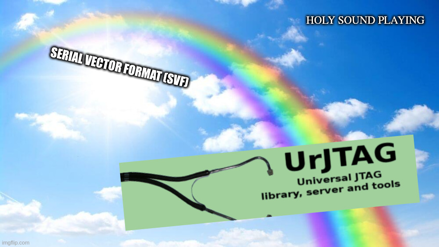
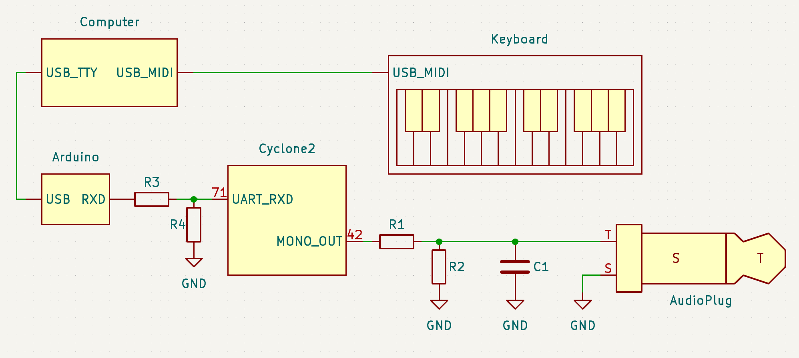
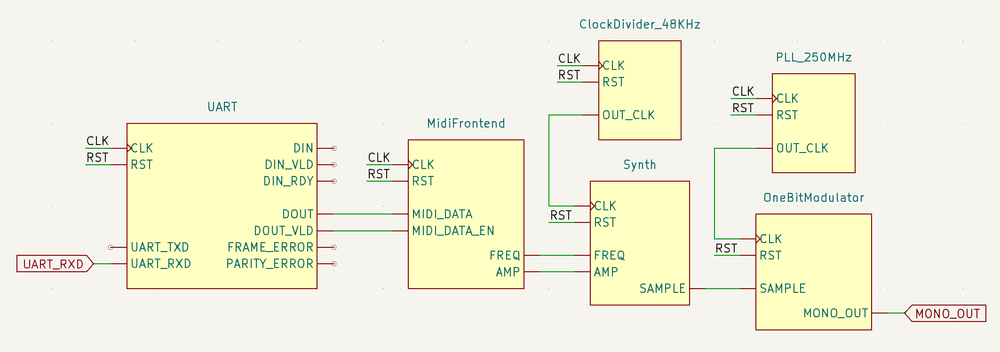
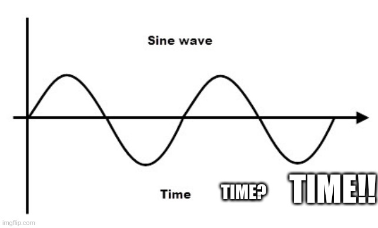
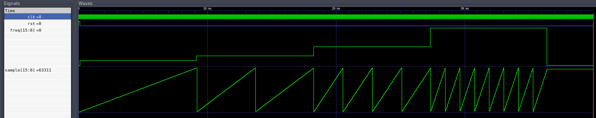
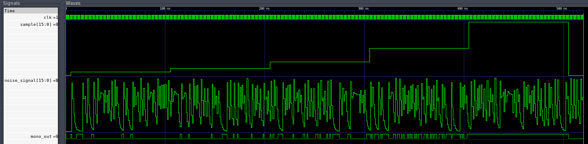

---
title:
- Proyecto Final
author:
- Nikita Zdanovitch
- Martín Fraga
theme:
- Copenhagen
date:
- Julio 13, 2023
toc: true
mainfont: "Hack Nerd Font"
fontsize: 11pt
---

# Introducción

## Problema

## Xilinx no, Altera Sí

## Problemas programando la placa

## Open Source Rescue

# Desarollo

## Norte

## Comunicación con la placa

## Diagrama General

## UART

## Midiresumen

## Generando una señal

## Generando una señal periódica

## Generando una señal diente de sierra periódica

## Sacando sonido en un bit

## Usando un LFSR

## Reconstrucción

## Vistazo de nuevo a la placa

## Repaso Diagrama General

# Prueba de sonido

## Vivo?

