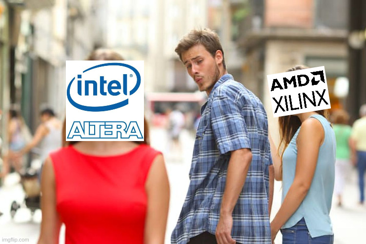

---
title:
- Proyecto Final
author:
- Nikita Zdanovitch
- Martín Fraga
theme:
- Copenhagen
date:
- Julio 13, 2023
toc: true
mainfont: "Hack Nerd Font"
fontsize: 11pt
---

# Introducción

## Problema

## Norte

## Xilinx no, Altera Sí

## Problemas programando la placa

## Open Source Rescue

# Desarollo

## Comunicación con la placa

## Diagrama General

## Generando una señal

## Generando una señal periódica

## Generando una señal diente de sierra periódica

## Sacando sonido en un bit

## Usando un LFSR

## Protocolos Sobre los que nos basamos

### UART (para comunicarnos con la FPGA)

### MIDI (para representar notas)

# Preguntas?

# Miscelaneos (Si te quedaste manija)

## Reconstrucción

